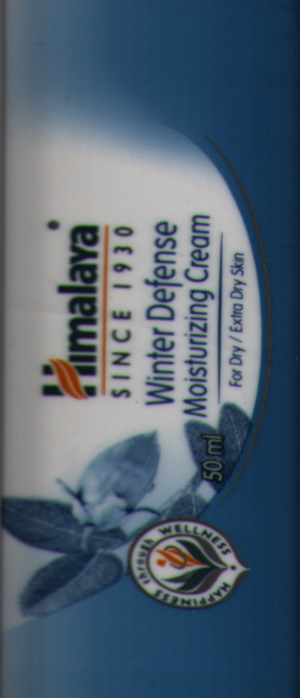
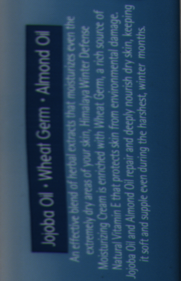
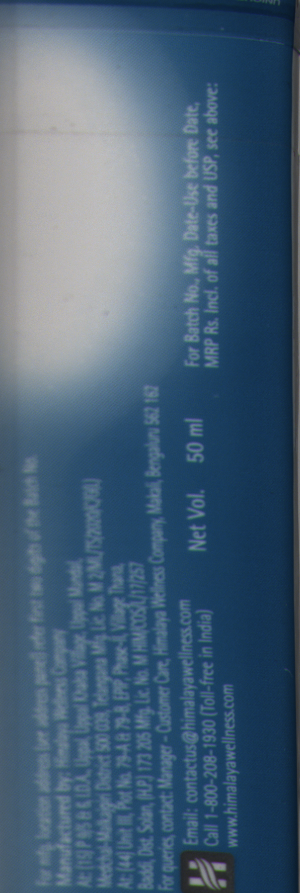
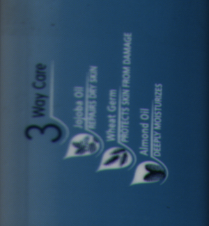

# Himalaya NSC Label Defect Detection — Team Guide
## 3 People · 5 Days · NVIDIA A500 GPU


---

## Project Summary

We inspect **Himalaya Winter Defense Moisturizing Cream (50 ml)** tube labels for defects
(tears, smudges, missing print, ink blobs). Each photo is a flat unwrapped image of the
cylindrical tube — **1504 × 8000 px, RGB, BMP format**.

Because the label wraps around the tube, the same content appears **twice** per image.
We use **template matching** to find the complete (uncut) occurrence of each ROI, crop it,
convert to grayscale, and pass it to a dedicated **EfficientAD** anomaly model.

---

## The 4 ROI Regions We Inspect

| ROI | Content | Assigned to | Critical |
|-----|---------|-------------|---------|
| **ROI_1** | Himalaya logo + "Winter Defense Moisturizing Cream" | **Person A** | ✅ Yes |
| **ROI_2** | "Jojoba Oil · Wheat Germ · Almond Oil" text + paragraph | **Person A** | No |
| **ROI_3** | Address + regulatory + MFG/EXP + barcode + Net Vol. | **Person B** | ✅ Yes |
| **ROI_4** | "3 Way Care" graphic with ingredient icons | **Person C** | No |

---

## Architecture

```
New RGB image (1504 × 8000 px)
         │
         ▼
  Template Matching  ←── finds each ROI in full image using saved patches
         │
         ├─ ROI_1 crop (gray) ──► EfficientAD Model 1 ──► score + heatmap ──► bboxes
         ├─ ROI_2 crop (gray) ──► EfficientAD Model 2 ──► score + heatmap ──► bboxes
         ├─ ROI_3 crop (gray) ──► EfficientAD Model 3 ──► score + heatmap ──► bboxes
         └─ ROI_4 crop (gray) ──► EfficientAD Model 4 ──► score + heatmap ──► bboxes
                                            │
                              PASS/FAIL + annotated RGB image + JSON
```

---

## Important: The Cylindrical Split Rule

Each region appears **twice** per image (label wraps around the tube).
Sometimes one occurrence is cut at the top or bottom edge.

```
Image top ────────────────
[ ROI_1 cut (top half) ]  ← INCOMPLETE — skip this one
[ ROI_2 complete       ]  ← USE THIS
[ ROI_3 complete       ]  ← USE THIS
[ ROI_4 complete       ]  ← USE THIS
[ ROI_1 complete       ]  ← USE THIS — full logo visible
[ ROI_2 complete       ]  ← (second occurrence, also ok)
[ ROI_3 cut (btm half) ]  ← INCOMPLETE — skip this one
Image bottom ─────────────
```

**Rule: always select the COMPLETE, uncut occurrence. If both are cut, press S to skip.**

---

## 5-Day Timeline

```
Day 1  │  A+B+C: Setup Python env, download dataset
       │  A: Start cropping ROI_1 and ROI_2
       │  B: Start cropping ROI_3
       │  C: Start cropping ROI_4

Day 2  │  A+B+C: Continue cropping + annotate bad crops while cropping
       │  B: Set up GPU env on remote PC (parallel to cropping)

Day 3  │  A+B+C: Finish all cropping + annotation
       │  Upload all data/rois/ to remote PC
       │  B: Verify folder counts, start training

Day 4  │  B: Training completes (~45 min), calibrate thresholds
       │  A: Wire anchor.py into inference pipeline
       │  C: Visual spot-check of model outputs

Day 5  │  All: End-to-end test on full image set, tune thresholds
```

---

## Dataset Numbers

| | Count |
|---|---|
| Good full images | 80 |
| Bad full images | 52 |
| **Total images to crop per ROI** | **132** |
| Person A total crops (ROI_1 + ROI_2) | 264 |
| Person B total crops (ROI_3) | 132 |
| Person C total crops (ROI_4) | 132 |

> The number of bad crops per ROI will vary — some ROIs have more visible defects than others. That is expected.

---

---

# ═══════════════════════════════════════════
# PERSON A — ROI_1 + ROI_2 Cropping + Pipeline
# ═══════════════════════════════════════════

**Your ROIs:** ROI_1 (Logo) + ROI_2 (Ingredient text)
**Your PC:** Local (no GPU needed for cropping)

---

## Your Target Region — ROI_1

> **Himalaya logo, "SINCE 1930", "Winter Defense Moisturizing Cream", wellness seal**



Crop from the very top of the Himalaya mountain logo to just below the wellness seal circle.
**Width:** include the full label content, exclude the dark tube edges on left/right if easy, otherwise don't worry.

---

## Your Target Region — ROI_2

> **"Jojoba Oil · Wheat Germ · Almond Oil" header + the paragraph text below it**



Crop from the black "Jojoba Oil · Wheat Germ · Almond Oil" header bar to the last line of the paragraph text.

---

## A1. Setup (Day 1)

```powershell
# Clone repo (if not already done)
git clone https://github.com/ShreyasBairyKS/Capstone-Project.git
cd Capstone-Project
git checkout himalaya-label-detection

# Install dependencies
pip install opencv-python numpy
```

---

## A2. Download Dataset (Day 1)

Copy the full dataset to your local machine:
```
dataset/
  NSC/
    NSC GOOD IMAGES/   ← 80 images (*.bmp)
    NSC BAD IMAGES/    ← 52 images (*.bmp)
```

---

## A3. Crop ROI_1 (Day 1–2)

```powershell
python himalaya_label_detection/scripts/crop_roi.py \
  --roi ROI_1 \
  --images dataset/NSC \
  --out-dir data/rois/ROI_1
```

**What to do in the window:**
1. The full image opens (scrollable). It is tall — scroll to find the COMPLETE logo.
2. Click and drag a box around the entire logo region (top of mountain to bottom of wellness seal).
3. If the logo at the TOP is cut off → scroll down to find the second complete occurrence.
4. Press **G** if the crop looks good/normal.
5. Press **B** if you can see a visible defect (smudge, tear, ink blob, missing print).
6. Press **S** if BOTH occurrences of this region are incomplete/cut.
7. Press **R** to redraw if your box was wrong.

Progress is auto-saved. To resume after a break:
```powershell
python himalaya_label_detection/scripts/crop_roi.py --roi ROI_1 --images dataset/NSC --out-dir data/rois/ROI_1 --start-from 45.bmp
```

---

## A4. Crop ROI_2 (Day 2)

```powershell
python himalaya_label_detection/scripts/crop_roi.py \
  --roi ROI_2 \
  --images dataset/NSC \
  --out-dir data/rois/ROI_2
```

Same steps. Crop from the "Jojoba Oil" header bar to the end of the paragraph text.

---

## A5. Annotate Bad Crops with Bounding Boxes (during or after cropping)

For each bad image you saved (anything in `data/rois/ROI_1/bad/` and `data/rois/ROI_2/bad/`),
draw a bounding box around the exact defect location.

```powershell
pip install labelImg
labelImg
```
1. **Open Dir** → `data/rois/ROI_1/bad/`
2. Format: **YOLO** (left panel)
3. **Change Save Dir** → `data/annotations/ROI_1/`
4. Press `W` to draw box, choose class, `D` for next, `Ctrl+S` to save.

Classes: `scratch`, `tear`, `ink_blob`, `smudge`, `wrinkle`, `missing_print`, `unknown_defect`

Repeat for `ROI_2/bad/`.

---

## A6. Upload Crops to Remote PC (Day 3)

Upload your completed folders to the remote training PC:
```
data/rois/ROI_1/good/     (all PNG crops)
data/rois/ROI_1/bad/
data/annotations/ROI_1/
data/rois/ROI_2/good/
data/rois/ROI_2/bad/
data/annotations/ROI_2/
```
Use SCP, Google Drive, USB, or any file transfer method.

---

## A7. Save Template Patches + Validate (Day 1, parallel to cropping)

These are used by the inference pipeline. Run once:
```powershell
python himalaya_label_detection/scripts/save_templates.py
python validate_anchors.py
```
All images should show OK. Share any failures with the team.

**Person A deliverables:**
- [ ] `data/rois/ROI_1/good/` and `ROI_1/bad/` — 132 crops total
- [ ] `data/rois/ROI_2/good/` and `ROI_2/bad/` — 132 crops total
- [ ] `data/annotations/ROI_1/` and `annotations/ROI_2/` — YOLO bbox files
- [ ] Template patches in `config/` + validate_anchors.py 100% pass

---

---

# ═══════════════════════════════════════════
# PERSON B — ROI_3 Cropping + GPU Training
# ═══════════════════════════════════════════

**Your ROI:** ROI_3 (Address + regulatory)
**Your PC:** Local for cropping → Remote PC (A500) for training

---

## Your Target Region — ROI_3

> **Himalaya Drug Company address, regulatory/license numbers, MFG/EXP dates, barcode, "Net Vol. 50 ml"**



Crop from the first line of the address text block to the barcode/net vol at the bottom.

---

## B1. Setup (Day 1)

```powershell
git clone https://github.com/ShreyasBairyKS/Capstone-Project.git
cd Capstone-Project
git checkout himalaya-label-detection
pip install opencv-python numpy
```

---

## B2. Download Dataset + Crop ROI_3 (Day 1–2)

```powershell
python himalaya_label_detection/scripts/crop_roi.py \
  --roi ROI_3 \
  --images dataset/NSC \
  --out-dir data/rois/ROI_3
```

Same controls: **G** = good, **B** = bad, **S** = skip, **R** = redo, **Q** = quit.

Crop from the top of the address text to below "Net Vol. 50 ml".

---

## B3. Annotate Bad Crops (Day 2–3)

```powershell
labelImg
```
1. Open Dir → `data/rois/ROI_3/bad/`
2. Format: YOLO, Save Dir → `data/annotations/ROI_3/`
3. Draw boxes, save.

---

## B4. GPU Setup on Remote PC (Day 1–2, parallel)

```bash
conda create -n himalaya python=3.10 -y
conda activate himalaya

# PyTorch with CUDA for A500
pip install torch torchvision --index-url https://download.pytorch.org/whl/cu118

# Verify
python -c "import torch; print('GPU:', torch.cuda.get_device_name(0))"

pip install anomalib==1.1.0
pip install opencv-python scikit-image pillow numpy tqdm matplotlib
```

---

## B5. Collect All Data on Remote PC (Day 3)

Wait for Person A and C to upload their crops. Then verify:

```bash
python himalaya_label_detection/scripts/organise_roi_folders.py \
  --rois-root data/rois --verify
```

Expected:
```
ROI_1/good: 80    ROI_1/bad: 52
ROI_2/good: 80    ROI_2/bad: 52 (may vary)
ROI_3/good: 80    ROI_3/bad: 52 (may vary)
ROI_4/good: 80    ROI_4/bad: 52 (may vary)
```

---

## B6. Train All 4 EfficientAD Models (Day 3, ~1 hour on A500)

```bash
cd himalaya_label_detection

python scripts/train_all_rois.py \
  --rois-root data/rois \
  --models-root models/rois \
  --model efficientad \
  --epochs 100
```

If CUDA OOM: add `--batch-size 4`

---

## B7. Calibrate Thresholds (Day 4)

```bash
python scripts/calibrate_roi_thresholds.py \
  --rois-root data/rois \
  --models-root models/rois \
  --target-recall 0.95 \
  --plot
```

Green = good scores (LOW), Red = bad scores (HIGH). Vertical line = threshold.
If they overlap: retrain with `--epochs 200`.

**Person B deliverables:**
- [ ] `data/rois/ROI_3/good/` and `ROI_3/bad/`
- [ ] `data/annotations/ROI_3/`
- [ ] 4 trained model folders in `models/rois/`
- [ ] `config/roi_thresholds.json` with calibrated values (not 0.5)

---

---

# ═══════════════════════════════════════════
# PERSON C — ROI_4 Cropping + Validation
# ═══════════════════════════════════════════

**Your ROI:** ROI_4 (3 Way Care graphic)
**Your PC:** Local

---

## Your Target Region — ROI_4

> **"3 Way Care" heading with Jojoba Oil / Wheat Germ / Almond Oil icons and captions**



Crop from "3 Way Care" text to below the last icon caption ("Deeply Moisturizes").

---

## C1. Setup (Day 1)

```powershell
git clone https://github.com/ShreyasBairyKS/Capstone-Project.git
cd Capstone-Project
git checkout himalaya-label-detection
pip install opencv-python numpy
```

---

## C2. Download Dataset + Crop ROI_4 (Day 1–2)

```powershell
python himalaya_label_detection/scripts/crop_roi.py \
  --roi ROI_4 \
  --images dataset/NSC \
  --out-dir data/rois/ROI_4
```

Controls: **G** = good, **B** = bad, **S** = skip, **R** = redo, **Q** = quit.

---

## C3. Annotate Bad Crops (Day 2–3)

```powershell
pip install labelImg
labelImg
```
1. Open Dir → `data/rois/ROI_4/bad/`
2. Format: YOLO, Save Dir → `data/annotations/ROI_4/`
3. Draw boxes around defects, save.

---

## C4. Upload to Remote PC (Day 3)

```
data/rois/ROI_4/good/
data/rois/ROI_4/bad/
data/annotations/ROI_4/
```

---

## C5. Visual Validation (Day 5)

After Person B trains and Person A wires the inference:

```powershell
python himalaya_label_detection/scripts/run_roi_inference.py \
  --folder "dataset\NSC\NSC BAD IMAGES" \
  --save-output outputs\bad_results
```

Check 10–15 output images:
- Bad images → red bounding boxes should be near visible defects ✅
- Good images → should show PASS, no boxes ✅
- Write notes: `"Image 3.bmp: FAIL ROI_1 — box on smudge near logo ✓"`

**Person C deliverables:**
- [ ] `data/rois/ROI_4/good/` and `ROI_4/bad/`
- [ ] `data/annotations/ROI_4/`
- [ ] Day-5 validation notes

---

---

# Common Commands Reference

```powershell
# Any person — cropping
python himalaya_label_detection/scripts/crop_roi.py --roi ROI_X --images dataset/NSC --out-dir data/rois/ROI_X

# Resume after break
python himalaya_label_detection/scripts/crop_roi.py --roi ROI_X --images dataset/NSC --out-dir data/rois/ROI_X --start-from 45.bmp

# Verify folder counts (after all uploads)
python himalaya_label_detection/scripts/organise_roi_folders.py --rois-root data/rois --verify

# Person B — training (on remote PC)
python himalaya_label_detection/scripts/train_all_rois.py --rois-root data/rois --models-root models/rois

# Person B — calibration
python himalaya_label_detection/scripts/calibrate_roi_thresholds.py --plot

# Person A — inference test
python himalaya_label_detection/scripts/run_roi_inference.py --folder "dataset/NSC/NSC BAD IMAGES" --save-output outputs/
```

---

# Common Problems

| Problem | Fix |
|---------|-----|
| `ModuleNotFoundError: cv2` | `pip install opencv-python` |
| `ModuleNotFoundError: anomalib` | `pip install anomalib==1.1.0` |
| Window doesn't open / black screen | Try adding `--images` flag with correct path |
| Cropping tool too slow to scroll | Use `R` to reset, then draw box on resized view |
| CUDA not detected | Ask AI: *"torch.cuda.is_available() returns False, NVIDIA A500"* |
| LabelImg crash | Use https://app.cvat.ai (free online) instead |
| Git push rejected | `git pull origin himalaya-label-detection` first |
| Bad/good count too low for one ROI | That ROI just has fewer visible defects — that is OK |

---

# Git

```powershell
git pull origin himalaya-label-detection   # get latest before starting
git add .
git commit -m "add ROI_X crops"
git push origin himalaya-label-detection
```

Branch: `himalaya-label-detection`
Repo: https://github.com/ShreyasBairyKS/Capstone-Project
